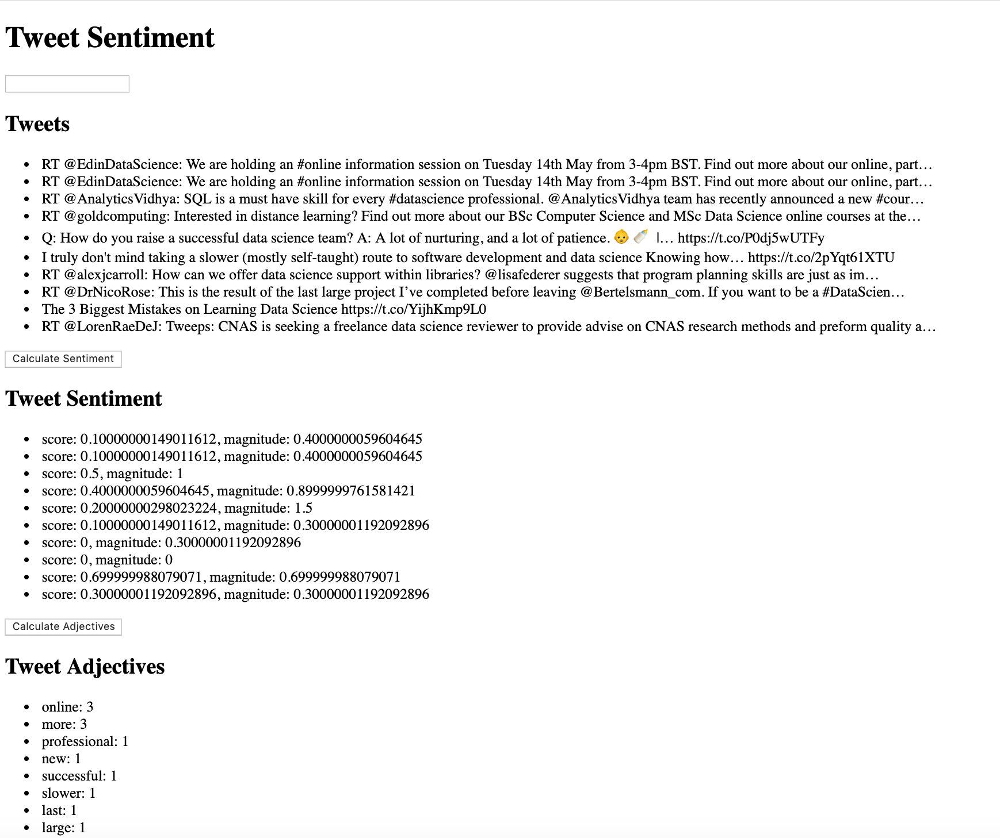

# twitter-sentiment
sentiment analysis for twitter

# Deployed Link
Deployed: http://ec2-3-87-189-31.compute-1.amazonaws.com:3000/?fbclid=IwAR0v_7I3jpcIsc2S7NNjavvR56rWKP8S-4_C5t3DT1n1pq6mOz5IWTG3pJw

# Getting started
1. Create service account key: https://cloud.google.com/storage/docs/reference/libraries
2. Once app is deployed on server copy the service account json file to home directory (ex. google-text-analytics-api.json)
3. Set GOOGLE_APPLICATION_CREDNTIALS environment variable in the home directory to be path of the google service acccount json file (ex. export GOOGLE_APPLICATION_CREDENTIALS=/home/ubuntu/twitter-sentiment/google-text-analytics-api.json)
4. run `npm run build` then ctrl + c
5. run `npm run server`

# Using App
1. Type a phrase or word into search bar and press enter. App will search Twitter API for last 15 most recent tweets today where word/phrase is included
2. Click `Calculate Sentiment` to see associated score and magnitude for each tweet displayed
3. Click `Calculate Ajdectives` to get list of adjectives and count adjectives seen in above list of tweets 
